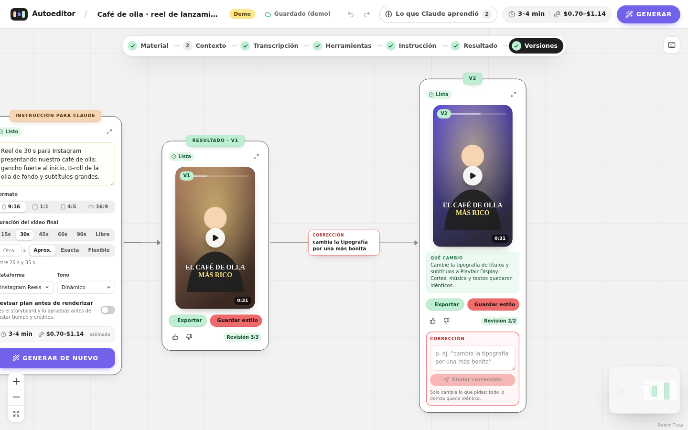

# Autoeditor de video con IA

Sube tu material, prende las opciones que quieras, escribe qué video quieres y **Claude lo edita**.
Recibes la V1, corriges con texto ("cambia la tipografía por una más bonita") y sale la V2 cambiando
**solo** lo que pediste. Cuando te gusta, **guardas el estilo** y la próxima vez solo subes material nuevo.

<p align="center"></p>

- **Flujo visual de izquierda a derecha:** MATERIAL → CONTEXTO → TRANSCRIPCIÓN → HERRAMIENTAS →
  INSTRUCCIÓN → (PLAN) → RESULTADO → VERSIONES. Lo que apagas queda como un chip pequeño; lo que prendes se
  despliega y el diagrama se reacomoda solo.
- **Transcripción con tiempos por palabra**, subtítulos tipo karaoke con **palabras clave** resaltadas,
  exportación .srt/.vtt y un **glosario** que aprende cómo se escriben tus nombres y marcas.
- **Detección de B-roll:** distingue tomas de alguien hablando (A-roll) de tomas de apoyo (B-roll) y las usa
  de fondo o como cortes.
- **Duración del video final** con modo automático, aproximado (±15 %) o exacto (±0.5 s).
- **Motion graphics** con HyperFrames, **imágenes, video, efectos y voz con IA** vía Kie AI.
- **Tiempo y costo estimados** antes de generar, que se recalibran con cada render real.
- **Aprende contigo:** reglas cortas y verificables sacadas de tus correcciones, visibles y editables en
  "Lo que Claude aprendió".
- **Estilos como Skills de Claude** (SKILL.md + preset + assets) que también funcionan en Claude Code y Warp.

La especificación completa del producto está en [`PROMPT.md`](PROMPT.md) y las decisiones técnicas en
[`docs/DECISIONES.md`](docs/DECISIONES.md).

---

## Instalación en tu computadora

### Requisitos

| Herramienta | Versión | Cómo instalar |
|---|---|---|
| Node.js | 22.20 o más nuevo | [nodejs.org](https://nodejs.org) o `nvm install` (lee `.nvmrc`) |
| pnpm | 10 | `corepack enable` |
| ffmpeg | 6 o más nuevo (con libass) | macOS `brew install ffmpeg` · Windows `winget install Gyan.FFmpeg` · Linux `sudo apt install ffmpeg` |
| Python | 3.9 o más nuevo | [python.org](https://www.python.org) (para la transcripción local) |
| git | cualquiera | para instalar las skills |

### Un comando para instalar, uno para arrancar

```bash
git clone https://github.com/dachjuegaconbarbies/editor-de-video.git
cd editor-de-video
corepack enable          # si no tienes pnpm
pnpm install
pnpm instalar            # worker de Python, navegador de HyperFrames, skills, .env y carpetas
pnpm dev                 # abre http://localhost:5173
```

`pnpm instalar` revisa todo y te dice qué falta con la instrucción exacta para tu sistema. Para solo revisar,
sin instalar nada: `pnpm diagnostico`.

> Opcional: `pnpm instalar -- --modelo small` descarga de una vez el modelo de transcripción
> (`tiny`, `base`, `small`, `medium`, `large-v3` o `turbo`). Si no, se descarga la primera vez que transcribes.

### Llaves de API (en `.env`, nunca en el navegador)

```bash
ANTHROPIC_API_KEY=...   # Claude edita tus videos (sin ella: modo demo con editor automático sin IA)
KIE_API_KEY=...         # imágenes, video, música, voz y efectos con IA (sin ella: marcadores de prueba)
```

Sin llaves, la app funciona de punta a punta en **modo demo**: un editor determinista quita silencios y
muletillas, ajusta la duración, inserta B-roll, pone subtítulos y música, y entiende correcciones simples.
Con la llave de Claude, Claude Opus 5.5 edita como lo haría un editor profesional.
Si tu cuenta de Kie AI no tiene créditos, la app te lo dice y sigue sin esa parte.

### Material de prueba

```bash
pnpm material-prueba     # genera en data/muestras: a-roll con voz, b-rolls, foto, música, efectos, logo y guion
```

---

## Cómo se usa

1. **Inicio:** "Nuevo desde cero" o "Usar un estilo".
2. **MATERIAL:** arrastra tus videos, fotos, notas de voz, música, efectos, logos. Marca los videos que deben
   aparecer. El análisis (transcripción, escenas, silencios, A-roll/B-roll) arranca solo en segundo plano.
3. **CONTEXTO (opcional):** prende **TENGO GUION**, **TENGO IDENTIDAD DE MARCA** o **TENGO REFERENCIAS
   VISUALES** si los tienes.
4. **TRANSCRIPCIÓN:** corrige palabras (se guardan en tu glosario), marca frases para quitar, que deben ir o
   resaltar, y edita las palabras clave.
5. **HERRAMIENTAS:** prende lo que quieras desde la paleta morada: B-roll, zooms, música, efectos, motion
   graphics, IA imágenes, IA videos…
6. **INSTRUCCIÓN:** describe el video, elige formato, **duración**, plataforma y tono. Revisa el tiempo y costo
   estimados y pulsa **GENERAR**. (Prende "Revisar plan antes de renderizar" para aprobar el storyboard primero.)
7. **RESULTADO:** ve la V1, exporta, califica, **corrige con texto** o tocando un momento del video. Cada
   corrección crea una versión nueva conectada con la anterior y dice "qué cambió".
8. **GUARDAR ESTILO:** guarda todo lo que te gustó (tipografías, colores, ritmo, subtítulos, plantillas,
   herramientas, instrucción base) para reutilizarlo con material nuevo.

---

## Seguir desarrollándolo en Warp o Claude Code

El repositorio está listo para que un agente siga trabajando en tu computadora:

- **`AGENTS.md`** (raíz): estructura, reglas no negociables, comandos y convenciones. **Warp lo lee solo**;
  Claude Code lo lee a través de `CLAUDE.md` (que contiene `@AGENTS.md`). No crees `WARP.md`: si existe, Warp lo
  usa en lugar de `AGENTS.md`.
- **Skills:** `pnpm instalar` instala las skills de HyperFrames y de Kie AI para **Claude Code y Warp**
  (`.claude/skills/` y `.agents/skills/`).
- En Warp, abre la carpeta del proyecto y pide en modo Agent, por ejemplo: *"Lee AGENTS.md y PROMPT.md y
  agrega X"*. Con Claude Code dentro de Warp: `claude` en la terminal del proyecto.
- Antes de dar algo por terminado: `pnpm typecheck && pnpm test`.

---

## Comandos

| Comando | Qué hace |
|---|---|
| `pnpm instalar` | Instala y configura todo (ver arriba) |
| `pnpm diagnostico` | Revisa Node, ffmpeg, Python, transcripción, llaves, skills y HyperFrames |
| `pnpm dev` | Servidor (http://localhost:4000) + interfaz con recarga (http://localhost:5173) |
| `pnpm start` | Compila la interfaz y la sirve desde el servidor en http://localhost:4000 |
| `pnpm typecheck` | Revisión de tipos en todos los paquetes |
| `pnpm test` | Pruebas unitarias (no necesitan llaves ni red) |
| `pnpm test:e2e` | Pruebas de interfaz con Playwright |
| `pnpm material-prueba` | Genera material de prueba en `data/muestras` |
| `pnpm --filter @autoeditor/web build:demo` | Demostración estática de la interfaz, sin servidor (`apps/web/dist-demo`) |

La API documentada (OpenAPI) queda en **http://localhost:4000/api/v1/docs**.

---

## Estructura

```
packages/shared   Contratos: receta (timeline JSON), settings, entidades, API/SSE, estimador, diff, subtítulos
packages/editor   Componente React <AutoEditor/> montable en otra app
apps/server       API REST + SSE, cola de trabajos, SQLite, análisis, transcripción, render, motion, IA
apps/web          App anfitriona local
workers/python    Transcripción (faster-whisper) y detección de rostros (OpenCV)
config/           models.json, providers.json, estimator.json (modelos, precios y proveedores editables)
scripts/          Instalador/diagnóstico y generador de material de prueba
docs/             Decisiones, investigación de herramientas, capturas
data/             (local, ignorado por git) base de datos, archivos subidos y renders
```

---

## Integración con Zyra

El editor está pensado para montarse dentro del backend y la web de Zyra sin reescribirse:

- **API-first:** todo lo que hace la interfaz se puede hacer por la API REST (`/api/v1`, OpenAPI en
  `/api/v1/docs`) y los eventos en vivo por SSE (`GET /api/v1/projects/:id/events`).
- **Componente montable:**

  ```tsx
  import { AutoEditor } from "@autoeditor/editor";
  import "@autoeditor/editor/styles.css";

  <AutoEditor apiBaseUrl="https://api.zyra.com/autoeditor/api/v1" ownerId={usuario.id}
              headers={() => ({ Authorization: `Bearer ${token}` })} onEvent={(e) => analytics.track(e)} />
  ```

- **Multiusuario:** todas las tablas y consultas llevan `owner_id`. El dueño sale del header `X-Owner-Id`
  (configurable con `OWNER_HEADER`) o de un resolver propio que verifique el token de Zyra:
  `buildApp({ resolveOwner })` en `apps/server/src/app.ts`.
- **Base de datos y archivos intercambiables:** SQLite (`node:sqlite`) y disco local detrás de interfaces
  (`apps/server/src/db`, `apps/server/src/storage`) para pasar a Postgres y S3 implementando esos adaptadores.
- **Llaves solo en el servidor:** `/api/v1/config` expone únicamente qué capacidades están listas.
- **CORS:** `CORS_ORIGINS` en `.env` cuando la interfaz vive en otro dominio.

---

## Licencias y notas

- **Remotion** es un motor opcional y está **apagado**: requiere licencia de empresa a partir de 4 personas y,
  para renders automatizados, el plan "Automators" (USD 0.01 por render, mínimo USD 100 al mes). El motor por
  defecto es **HyperFrames**. Detalles en `docs/research/skills-remotion-warp.md`.
- Kie AI cambia modelos y precios seguido: edítalos en `config/providers.json` (los costos reales de cada
  generación se muestran después del render).
- No se descarga contenido de redes sociales contra sus términos: si un link de referencia no se puede analizar,
  la app te pide una captura o el archivo.
